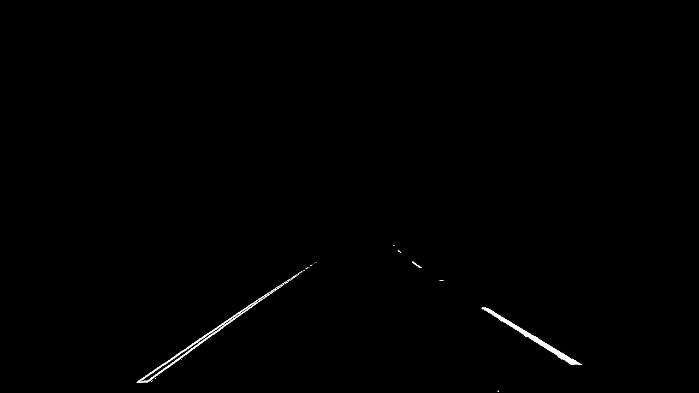
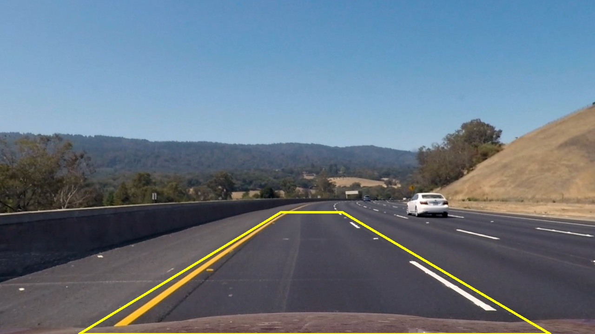
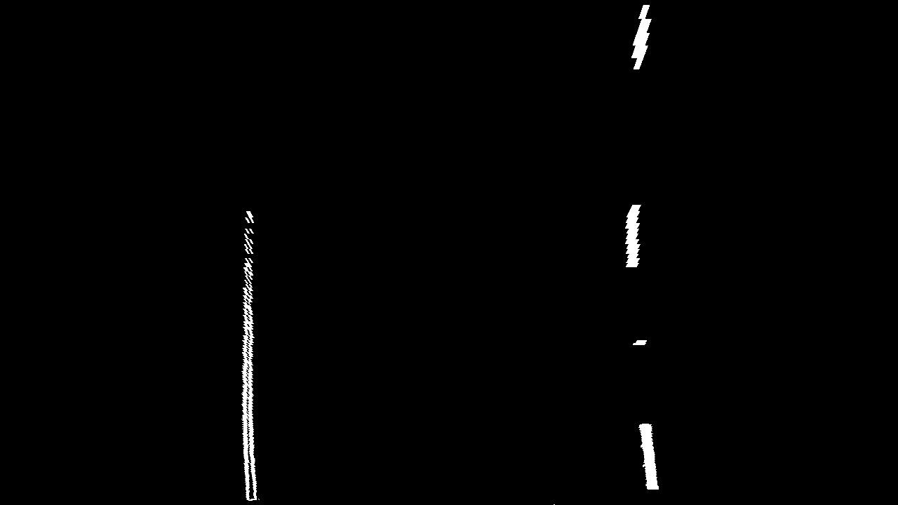
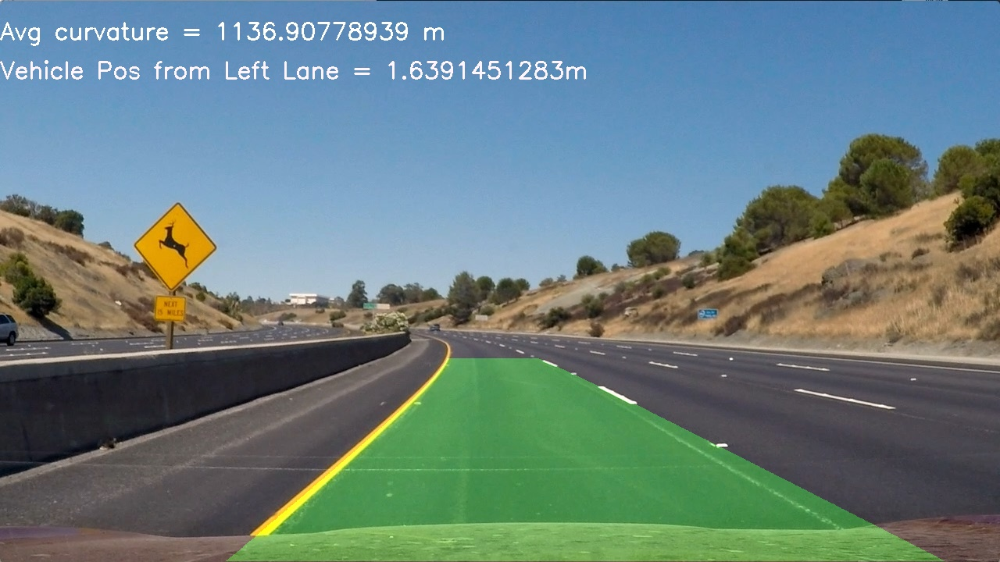

# Advanced Lane Line Finding

## Overview

This repository contains a Python program to find lane lines on the road.

All the code is in lanelines.py
The sample results are in output_files.

## Dependencies

* Python 3.5
* NumPy
* OpenCV
* Matplotlib
* MoviePy

## Running the code

### Demo Run

Run:

```
python lanelines.py
```

## Writeup / Reflection

#### 1. Provide a Writeup / README that includes all the rubric points and how you addressed each one. 

You're reading it!

### Camera Calibration

#### 1. Briefly state how you computed the camera matrix and distortion coefficients. Provide an example of a distortion corrected calibration image.

The whole camera calibration process is implemented in the Camera_Calibrator class in line 53 of lanelines.py. The  extract_calibration_points() method in line 64 obtains "object points" (real position of the chessboard corners in the world) and the "image points" (position of corners in the image). With those, the calibrate_camera() method in line 98 calculates the camera calibration and distortion coefficients. Those coefficients are used in cv2.undistort() to undistort an image.

The distortion correction can be displayed in the following images. The correction is more obviously seen in the top border of the image.


### Pipeline (single images)

#### 1. Provide an example of a distortion-corrected image.


#### 2. Describe how (and identify where in your code) you used color transforms, gradients or other methods to create a thresholded binary image.  Provide an example of a binary image result.

The thesholded binary is produced by the apply_all() method of the Thresholder class in line 254. A mask is used first to only consider the expected location of the road. (line 259). Then, the horizontal gradient, vertical gradient, magnitude of the gradient, direction of the gradient, S channel and L channel (in HLS space)are combines as follow in line 273:

```python
gradient_bin[( ( (gradx == 1) | (grady == 1)| (s_binary == 1) ) & ((dir_binary == 1) & (mag_binary == 1)) )] = 1
...
combined_binary[(gradient_bin == 1) | (l_binary == 1)] = 1
```
The result of this is:



#### 3. Describe how (and identify where in your code) you performed a perspective transform and provide an example of a transformed image.

In line 134, the method warp() of the class Perspective_Transformer transforms the image. The source and destination are calculated in line 509 as follow:

```python
def calculate_src_and_dest(self,img):
    img_size = (img.shape[1], img.shape[0])
    src_w = np.float32([[img_size[0]*0.4, img_size[1]*0.625],[img_size[0] *0.1, img_size[1]], [img_size[0]*0.9725, img_size[1]],[img_size[0]*0.6, img_size[1]*0.625]])
    dst_w = np.float32([[(img_size[0] / 4), 0],[(img_size[0] / 4), img_size[1]],[(img_size[0] * 3 / 4), img_size[1]],[(img_size[0] * 3 / 4), 0]])
    return src_w, dst_w
```

The results in the original image and in the binary warped image are:





![alt text][image4]

#### 4. Describe how (and identify where in your code) you identified lane-line pixels and fit their positions with a polynomial?

The method blind_histogram_search() in line 350, and margin_search() in line 445 find the points to fit the polynomial, and fit a curve.
The first method is only used in the first frame, when we search all over the image for the possible lane lines. After the first frame, margin_search uses the past location to search locally.


The resulting area enclosed look as follow:


#### 5. Describe how (and identify where in your code) you calculated the radius of curvature of the lane and the position of the vehicle with respect to center.

The following methods in line 321 are part of the Sliding_Window_Search()  class and calculate the curvature, and vehicle position respectively:
```python
    def find_curvature(self):
        # Define conversions in x and y from pixels space to meters
        ym_per_pix = 29.0/720 # meters per pixel in y dimension
        xm_per_pix = 3.0/700 # meters per pixel in x dimension

        # Fit new polynomials to x,y in world space
        plot_y = self.ploty*ym_per_pix
        left_x = self.left_line.bestx*xm_per_pix
        right_x = self.right_line.bestx*xm_per_pix
        left_fit_cr = np.polyfit(plot_y, left_x, 2)
        right_fit_cr = np.polyfit(plot_y, right_x, 2)
        # Calculate the new radii of curvature
        y_eval = np.max(plot_y)
        left_curverad = ((1 + (2*left_fit_cr[0]*y_eval*ym_per_pix + left_fit_cr[1])**2)**1.5) / np.absolute(2*left_fit_cr[0])
        right_curverad = ((1 + (2*right_fit_cr[0]*y_eval*ym_per_pix + right_fit_cr[1])**2)**1.5) / np.absolute(2*right_fit_cr[0])
    
        self.left_line.radius_of_curvature = left_curverad
        self.right_line.radius_of_curvature = right_curverad

        return (self.left_line.radius_of_curvature + self.right_line.radius_of_curvature)/2.0

    def find_vehicle_pos(self):
        ym_per_pix = 29.0/720 # meters per pixel in y dimension
        xm_per_pix = 3.0/700 # meters per pixel in x dimension
        vehicle_pos = self.left_line.line_base_pos*xm_per_pix
        return vehicle_pos
```

#### 6. Provide an example image of your result plotted back down onto the road such that the lane area is identified clearly.

Using the unwarp method in (line 554), we are able to obtain the following result:



##### Other sample results can be checked out in the "/output_files" folder.


---

### Pipeline (video)

#### 1. Provide a link to your final video output.  Your pipeline should perform reasonably well on the entire project video (wobbly lines are ok but no catastrophic failures that would cause the car to drive off the road!).

Here's a [link to my video result](./output_files/project_video.mp4)

---

### Discussion

#### 1. Briefly discuss any problems / issues you faced in your implementation of this project.  Where will your pipeline likely fail?  What could you do to make it more robust?


- I do not use any type of filtering. Therefore, this pipeline is not very robust to outliers, which can be caused by sudden change in light conditions for instance. To add robustness, averaging the fitted coefficients over a time window could be added.

- This pipeline does not work real-time. The image could be subsampled/compressed to improve the time-efficiency.

- The parameters for all the functions were chosen with images that were taken in full daylight. More diverse images could be used to choose more robust parameters.
  
